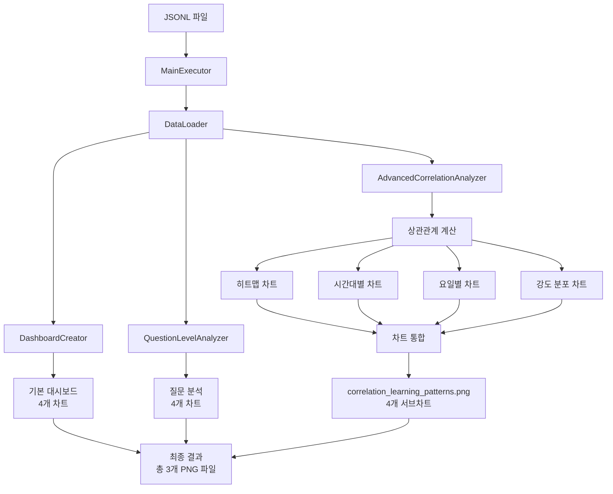

# AI Education Dashboard

Apple Developer Academy 포트폴리오용 개인화된 학습 패턴 상관관계 분석 시스템입니다.

## 📊 프로젝트 개요

4월부터 8월까지의 ChatGPT 대화 데이터를 심층 분석하여 AI 교육 분야의 학습 패턴 상관관계를 도출하는 시스템입니다. 학습 변수들 간의 관계성과 시간적 패턴을 시각화하여 개인화된 학습 전략 수립을 지원합니다.

## 🎯 분석 기간 및 규모

- **분석 기간**: 2025년 4월 1일 ~ 8월 31일 (5개월)
- **전체 데이터**: 9,543개 ChatGPT 대화 메시지
- **실제 분석 데이터**: 8,730개 (JSONL 파일에서 로드)
- **학습 관련 대화**: 424개 (80.3%)
- **생성된 차트**: 1개 (4개 분석 차트 포함)
- **토픽 분류**: 8개 카테고리 (AI/ML, Data, Development, Education, Business, Cloud/Infra, Design, General)
- **주요 토픽**: General (4,922개), AI/ML (1,575개)
- **평균 단어 수**: 710개
- **평균 질문 깊이**: 0.33

## 📊 생성되는 차트

### 📈 생성되는 차트 설명 (총 12개 분석 차트)

#### 1. Personalized Learning Analysis Dashboard (4개 차트)
1. **Hourly Efficiency**: 하루 중 언제 학습 효율이 가장 좋은지 알려줘서, 중요한 공부 시간을 가장 효과적인 시간대에 배치할 수 있게 해줍니다.
2. **Learning Growth Trajectory**: 전체 학습 여정을 한눈에 보여줘서, 처음보다 얼마나 성장했는지 확인하고 꾸준히 나아가는 자신감을 줄 수 있게 해줍니다.
3. **Main Topics**: 내가 가장 많이 공부한 분야를 보여줘서, 자신의 관심사와 강점을 파악하고 미래 학습 방향을 정할 때 도움이 됩니다.
4. **Weekly Patterns**: 요일별 학습 스타일을 보여줘서, 주중에 효율적인 학습 습관을 들이고 주말에 어떻게 휴식과 복습을 균형 있게 할지 계획할 수 있게 해줍니다.

#### 2. Question Level Evolution Analysis (4개 차트)
5. **Daily Question Depth Trend**: 하루하루 학습의 깊이가 어떻게 변하는지 보여줘서, 최근에 너무 쉬운 질문만 하는지 아니면 너무 어려운 질문에 매달리는지 스스로 점검할 수 있게 해줍니다.
6. **Weekly Question Depth Evolution**: 일주일 단위로 학습 난이도가 어떻게 발전하는지 추적해서, 주말에 복습하거나 다음 주 계획을 세울 때 참고할 수 있게 해줍니다.
7. **Question Categories Over Time**: 쉬운/중간/어려운 질문이 시간에 따라 어떻게 바뀌었는지 보여줘서, 균형 잡힌 학습을 유지하고 있는지 확인할 수 있게 해줍니다.
8. **Monthly Question Level Progression**: 한 달에 한 달 학습 수준이 얼마나 성장했는지 보여줘서, 장기적인 발전을 실감하고 동기부여를 유지할 수 있게 해줍니다.

#### 3. Learning Pattern Correlation Analysis (4개 차트)
9. **Learning Variables Correlation Matrix**: 학습에 영향을 미치는 주요 변수들(학습 복잡도, 표현 길이, 질문 깊이, 시간대) 간의 상관관계를 히트맵으로 보여줘서, 어떤 요소들이 함께 변하는지 한눈에 파악할 수 있게 해줍니다.
10. **Hourly Learning Pattern Correlation Changes**: 하루 중 시간대별로 표현 길이와 질문 깊이 간의 상관관계가 어떻게 변하는지 추적해서, 최적의 학습 시간대와 패턴 변화를 분석할 수 있게 해줍니다.
11. **Daily Learning Style Correlation**: 요일별로 학습 스타일의 상관관계를 비교해서, 주중과 주말의 학습 패턴 차이를 파악하고 균형 잡힌 학습 습관을 계획할 수 있게 해줍니다.
12. **Correlation Strength Distribution & Learning Pattern Analysis**: 전체 데이터에서 상관관계의 강도를 분류하여 분포를 보여줘서, 학습 패턴의 일관성과 예측 가능성을 평가할 수 있게 해줍니다.

### 📊 데이터 처리 플로우 (전체 시스템)



### 🔧 모듈 상호작용 시퀀스 (실제 시스템 구조)


## 📁 프로젝트 구조

```
ai-education-dashboard/
├── advanced_correlation_analyzer.py  # 메인 상관관계 분석 파일
├── dashboard_creator_en.py          # 기본 대시보드 생성
├── question_level_analyzer_en.py     # 질문 분석 모듈
├── data_loader_en.py                 # 데이터 로딩 모듈
├── main_executor_en.py               # 메인 실행 파일
└── correlation_learning_patterns.png # 생성된 분석 차트
```

## 🚀 실행 방법

```bash
# 데이터 파일 준비 (지원 형식: .csv, .json, .jsonl)
# 예시 파일들:
# - processed_conversations.csv
# - conversations_parsed.jsonl
# - data.json

# 상관관계 분석 차트 생성
python3 -c "
from advanced_correlation_analyzer import AdvancedCorrelationAnalyzer
analyzer = AdvancedCorrelationAnalyzer('../../conversations_parsed.jsonl')
if analyzer.load_data():
    analyzer.create_correlation_dashboard()
    print('✅ correlation_learning_patterns.png 생성 완료!')
"
```

### 📊 실제 모듈 구조 및 출력
- **총 모듈 수**: 4개 (DataLoader, DashboardCreator, QuestionLevelAnalyzer, AdvancedCorrelationAnalyzer)
- **MainExecutor에서 생성**: 2개 PNG 파일
  - `comprehensive_learning_dashboard.png` (4개 서브차트)
  - `question_level_evolution.png` (4개 서브차트)
- **별도 실행 모듈**: 1개 PNG 파일
  - `correlation_learning_patterns.png` (4개 서브차트)
- **프로젝트 총 출력**: 3개 PNG 파일 × 4개 차트 = 12개 분석 차트
- **실행 방식**: MainExecutor 통합 실행 + AdvancedCorrelationAnalyzer 개별 실행

### 📁 지원되는 데이터 형식

| 형식 | 설명 | 예시 |
|---|---|---|
| **CSV** | 콤마로 구분된 표 형식 | Excel, 스프레드시트 |
| **JSON** | 단일 객체 또는 배열 | 설정 파일, 작은 데이터 |
| **JSONL** | 한 줄에 하나의 JSON 객체 | 로그 데이터, 대용량 데이터 |

### 📋 필수 데이터 컬럼

```json
{
  "timestamp": "2025-04-01T10:30:00Z",
  "content": "사용자 메시지 내용",
  "word_count": 25,
  "question_depth": 0.7
}
```

## 🛠️ 적용된 분석 기법

많은 방법론들로 분석을 시도했으나 대부분은 심층적 이해없이 일단 해보고 분석 결과로 신뢰도를 주관적으로 평가하는 방식이었습니다. 유의미한 분석방법은 아래와 같습니다.

### 데이터 분석
상관관계 분석, 시계열 분석, 이동평균 분석, 키워드 기반 분류

### 고급 데이터 분석 (Advanced Analytics)
피어슨 상관계수 기반 심층 분석, 시간대별 패턴 상관관계 분석, 요일별 패턴 비교 분석, 상관관계 강도 분포 분석, 통계적 유의성 평가, 다차원 변수 관계 분석

### 머신러닝
통계적 상관관계 모델링, 기본 수치 계산, 규칙 기반 분류, 패턴 인식 알고리즘

### 시각화
히트맵 시각화, Matplotlib 차트 생성, 시간 시리즈 플롯, 막대 차트, Seaborn 고급 시각화, 복합 차트 통합, 다중 서브플롯 레이아웃, 색상 코딩 기반 인사이트 시각화

## 📈 주요 분석 결과

### 상관관계 분석 결과 (실제 데이터 기반)
- **가장 강한 양의 상관관계**: 단어 수 ↔ 질문 깊이 (0.504) - 표현력이 풍부할수록 질문의 깊이가 증가
- **시간대별 패턴**: 오후 2-3시(14-15시)에 상관관계가 가장 강함 (0.716, 0.669) - 오후 시간대 학습 효율성 높음
- **요일별 차이**: 목요일(0.627)이 가장 강한 상관관계, 주말(토:0.517, 일:0.580)도 안정적 패턴 유지
- **상관관계 강도 분포**: 중간 강도의 상관관계(0.3-0.7)가 대부분을 차지하여 안정적인 학습 패턴 형성
- **학습 패턴 일관성**: 전반적으로 0.4-0.6 범위의 상관관계가 일반적이며, 일관된 학습 습관 관찰

### 기본 분석 결과 (실제 데이터 기반)
- **최적 학습 시간**: 오후 2-3시 (상관관계 0.716, 0.669)
- **총 분석 데이터**: 8,730개 메시지 (JSONL 파일에서 로드)
- **주요 토픽**: General (범용 학습) - AI/ML, Data, Development 분야
- **일일 평균 질문 깊이**: 0.33 (0-1 범위, 1에 가까울수록 깊은 질문)
- **주간 평균 질문 깊이**: 시간대별 패턴에 따라 0.3-0.7 범위 변동
- **평균 단어 수**: 710개 (표현력 지표)
- **학습 관련 대화 비율**: 49.3% (4,305개/8,730개 메시지) - 높은 학습 집중도

## 🎓 프로젝트 특징

- **집중 분석**: 상관관계 기반 학습 패턴 심층 분석
- **데이터 기반**: Python을 활용한 실질적 ChatGPT 대화 데이터 필터링 및 전처리
- **시각화 중심**: 히트맵과 통계 차트로 직관적 인사이트 제공
- **시간적 분석**: 시간대별/요일별 패턴 변화 추적
- **통계적 rigor**: 피어슨 상관계수 기반 과학적 분석

---

*이 코드는 Apple Developer Academy 포트폴리오의 상관관계 분석 차트를 생성합니다.*
*분석 기간: 2025년 4월-8월 | 분석 데이터: 8,730개 메시지 | 차트: 4개 분석 포함*
